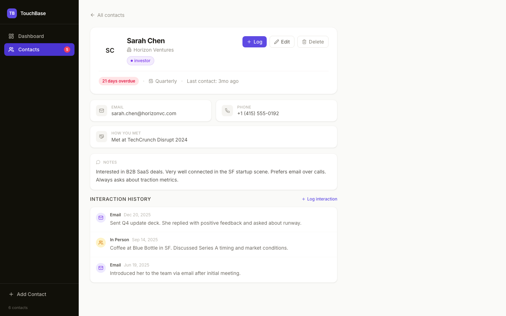

<p align="center">
  
</p>

<h1 align="center">TouchBase</h1>

<p align="center">
  A local-first personal CRM that helps you stay in touch with the people who matter.<br/>
  Track contacts, log interactions, and get nudged when someone is overdue for a check-in — all without sending your data to the cloud.
</p>

<p align="center">
  <a href="#features">Features</a> &nbsp;&middot;&nbsp;
  <a href="#getting-started">Getting Started</a> &nbsp;&middot;&nbsp;
  <a href="#built-with">Built With</a> &nbsp;&middot;&nbsp;
  <a href="#license">License</a>
</p>

---

## Features

### Smart Dashboard

See who needs attention at a glance. The dashboard surfaces overdue and upcoming contacts, tracks your interaction stats, and shows recent activity — so you always know who to reach out to next.

<p align="center">
  
</p>

### Contact Management

Organize your network with tags, notes, and configurable check-in cadences. Log every interaction — calls, emails, texts, in-person — and see the full relationship timeline on each contact's detail page.

<p align="center">
  
</p>

<p align="center">
  
</p>

### AI-Powered Outreach

Generate personalized messages for LinkedIn, email, or text based on your relationship context. Import contacts directly from LinkedIn profiles with AI-powered parsing. *(Requires an Anthropic API key.)*

### Command Palette

Hit `Cmd+K` to search contacts, trigger quick actions, and navigate instantly — no clicking required.

### Fully Local

All data lives in a single SQLite file on your machine. No accounts, no subscriptions, no cloud sync. Your relationships are your business.

---

## Getting Started

```bash
# Requires Node.js 22+
git clone https://github.com/bduffy089/touchbase.git
cd touchbase
npm install
npm run dev
```

Open [localhost:3000](http://localhost:3000). The database seeds itself with sample contacts on first run.

> **AI features (optional):** Set `ANTHROPIC_API_KEY` in a `.env.local` file to enable AI message suggestions and LinkedIn import.

---

## Built With

Next.js 14 &nbsp;&middot;&nbsp; React 18 &nbsp;&middot;&nbsp; TypeScript &nbsp;&middot;&nbsp; Tailwind CSS &nbsp;&middot;&nbsp; SQLite &nbsp;&middot;&nbsp; Claude AI &nbsp;&middot;&nbsp; Lucide Icons

---

## License

MIT
