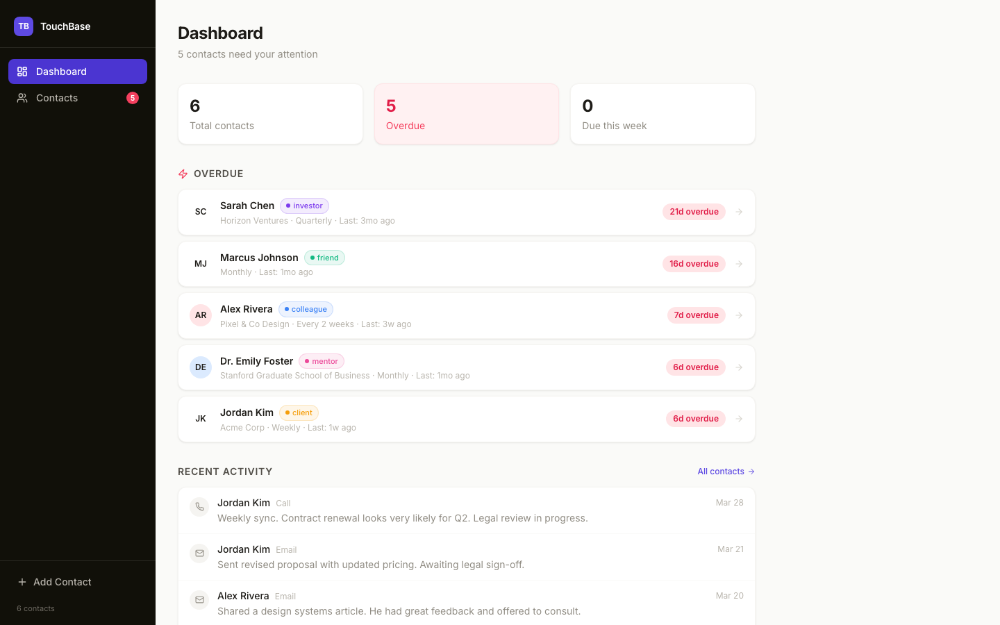
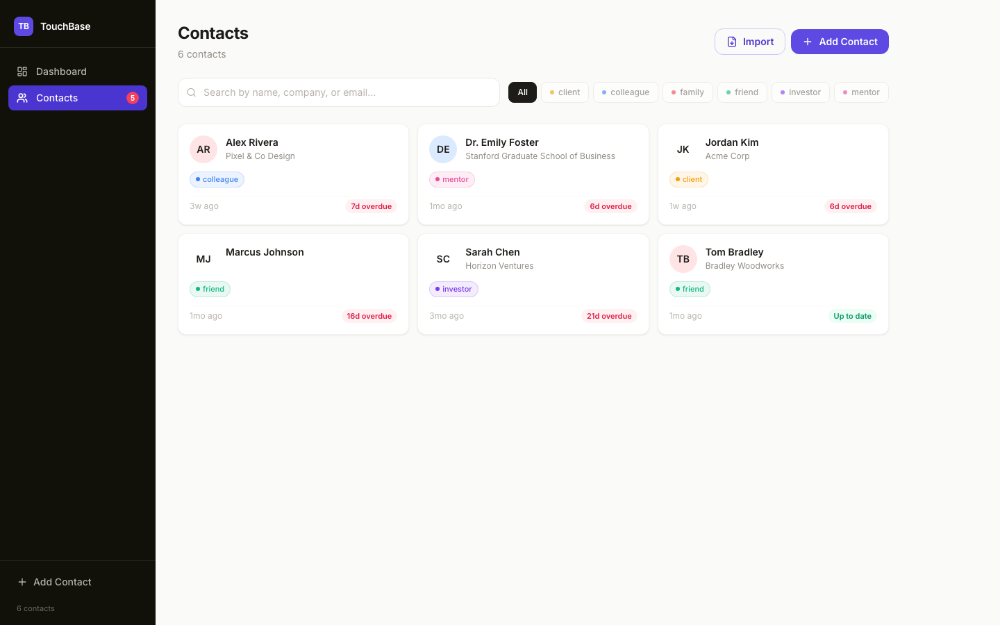

<p align="center">
  
</p>

<h1 align="center">TouchBase</h1>

<p align="center">
  A personal CRM with AI-powered outreach suggestions, relationship insights, LinkedIn import,<br/>
  and a command palette — built local-first with SQLite. No cloud. No subscriptions.
</p>

<p align="center">
  <a href="#features">Features</a> &nbsp;·&nbsp;
  <a href="#getting-started">Getting Started</a> &nbsp;·&nbsp;
  <a href="#stack">Stack</a>
</p>

---

## Why I Built This

Generic CRMs are overkill for personal networking. I wanted something fast, private, and actually smart — so I built it. Everything runs locally. Your data never leaves your machine.

---

## Features

### ⚡ Command Palette
Hit `Cmd+K` to search contacts, log interactions, and navigate — keyboard-first, no clicking required.

### 🤖 AI-Powered Outreach
Generate personalized LinkedIn messages, emails, or texts based on your actual relationship history. Powered by Claude (Anthropic). Set your API key once, use it everywhere.

### 🧠 AI Relationship Insights
Expand any contact to get instant AI-generated context: days since last contact, key topics from recent notes, and suggested conversation openers — streamed in real time.

### 📥 LinkedIn Import
Paste a LinkedIn profile URL → AI parses it into a structured contact. No manual data entry.

### 📊 Smart Dashboard
See who's overdue for a check-in at a glance. Tracks interaction cadence per contact and surfaces the ones falling through the cracks.

<p align="center">
  
</p>

### 🗂 Contact Management
Tags, notes, configurable check-in cadences, full interaction timeline (calls, emails, texts, in-person). Every relationship, in one place.

<p align="center">
  
</p>

---

## Getting Started

```bash
# Requires Node.js 22+
git clone https://github.com/bduffy089/touchbase.git
cd touchbase
npm install
npm run dev
```

Open [localhost:3000](http://localhost:3000). Seeds with sample contacts on first run.

**AI features:** Add `ANTHROPIC_API_KEY=your_key` to `.env.local` to enable outreach suggestions, relationship insights, and LinkedIn import.

---

## Stack

| Layer | Tech |
|---|---|
| Framework | Next.js 14 (App Router) |
| Language | TypeScript |
| Styling | Tailwind CSS |
| Database | SQLite (local file, zero config) |
| AI | Claude API (Anthropic) |
| Icons | Lucide |

---

## License

MIT
